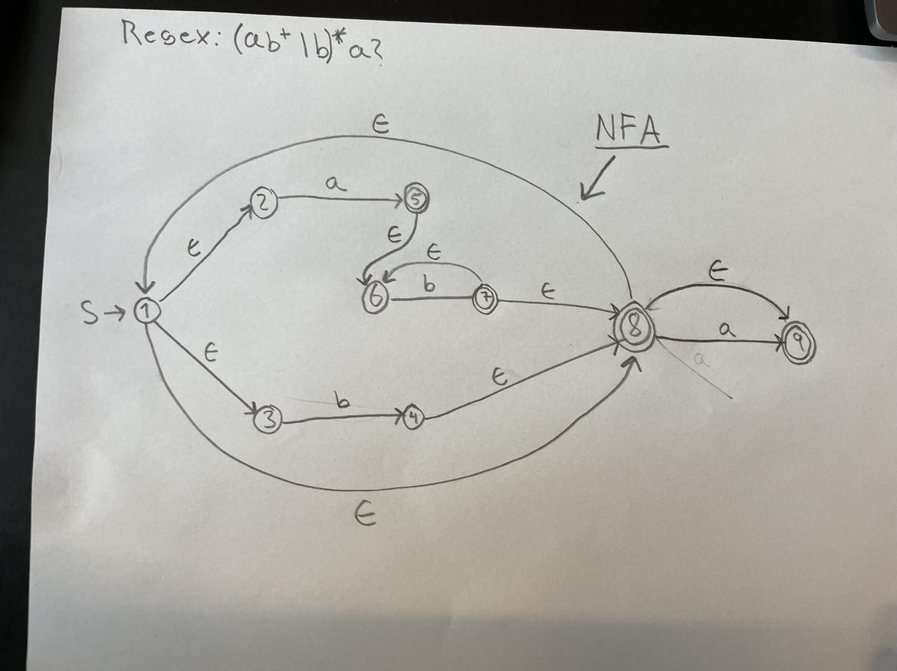
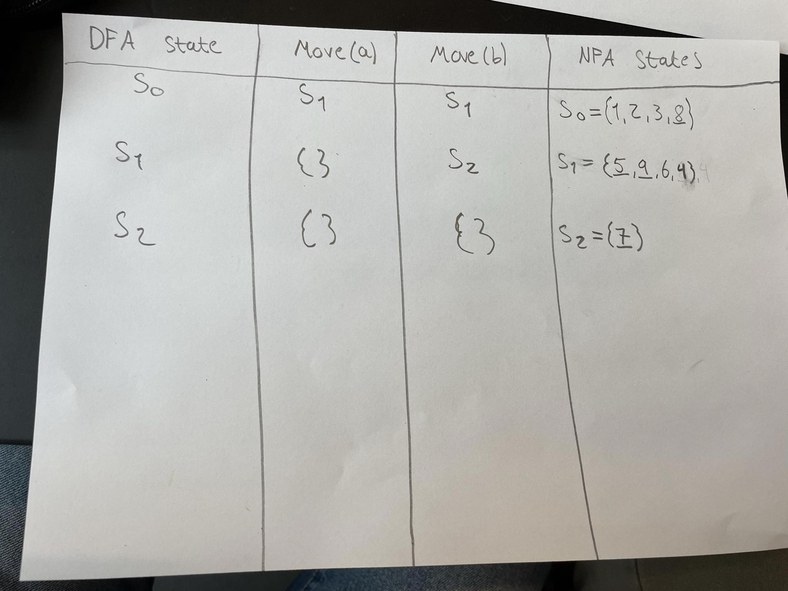
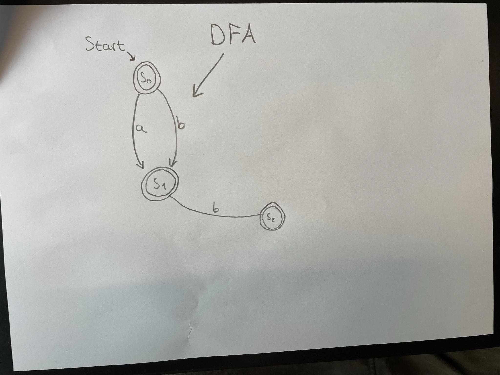

# Question 1
The regular expression is ['0'-'9'] - Meaning that we can tokenize 0 | 1 | 2 | 3 | 4 | 5 | 6 | 7 | 8 | 9 . It can only be a single character from this set of characters. ```LexBuffer<char>.LexemeString``` converts the matched digit into a string, which e.g. can later be printed to the console. The characters are processed as a string, where anything else than a non-digit input will trigger an error. 

# Question 2 
(2.1)
A hello.fs and a hello.fsi file is generated during the process. 

(2.2)
There are three states: State 0, 1 and 2. 

(2.6)

* That the lexer can parse 34 is expected behaviour since we have the regex rules which checks for zero or more repetitions of the numbers between 0 and 9. 
* That the lexer can recognise 34.34 is expected, because we have the regex rule that can match floating point numbers.
* That the lexer recognizes 34 when getting the input string 34,34 is expected behaviour because it does not recognize a "," instead of a ".", so therefore it succesfully recognise the first part "34" before the comma, but not the part after it. The reason it does not go into the failure case, is because that it partially matches until it cannot match anymore and then it just throws out the rest. 

# Question 3.2 

We have created the regex: $(ab{^2}|b)^{*}a?$

The NFA is shown below for this regex:
 

We derive to the DFA via the following table:
 

And the final DFA is:
 

