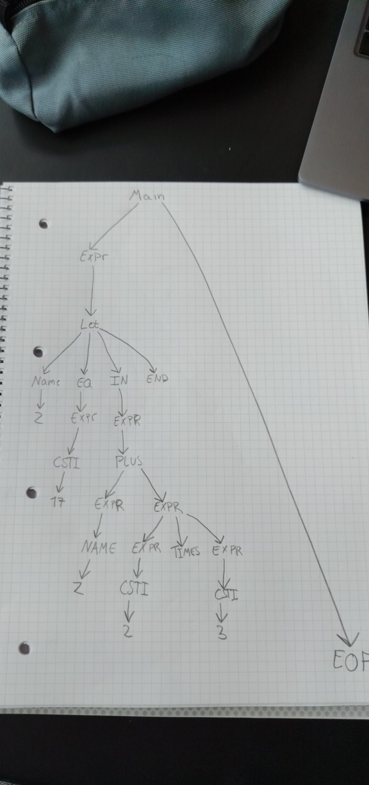

# Question 3.3

```
Main ::= Expr EOF 
Expr ::= NAME 
    | CSTINT 
    | MINUS CSTINT 
    | LPAR Expr RPAR 
    | LET NAME EQ Expr IN Expr END 
    | Expr TIMES Expr 
    | Expr PLUS Expr 
    | Expr MINUS Expr 

```
### Non-terminals:
$$V = \{ \text{EXPR}, \text{MAIN} \}$$

### Start-symbol:
$$S = \{ \text{MAIN} \}$$

### String 
```let z = (17) in z + 2 * 3 end EOF ```

### Terminal symbols
$$\Sigma = \{\text{let}, \text{in}, \text{end}, *, +, -, -\text{CSTINT}, \text{CSTINT}, \text{NAME}, \text{EOF}\}$$


### Production rules:
```
MAIN -> EXPR EOF //Rule A 
EXPR -> NAME //Rule B
EXPR -> CSTINT //Rule C
EXPR -> MINUS CSTINT //Rule D
EXPR -> LPAR EXPR RPAR //Rule E
EXPR -> LET NAME EQ EXPR IN EXPR END //Rule F
EXPR -> EXPR TIMES EXPR //Rule G
EXPR -> EXPR PLUS EXPR //Rule H
EXPR -> EXPR MINUS EXPR //Rule I
```

### Right most deviation:
``` 
let z = (17) in z + 2 * 3 end EOF -> 

MAIN ==> 
EXPR EOF ==>                                                 
LET NAME EQ EXPR IN (**EXPR**) END EOF ==>                  
LET NAME EQ EXPR IN EXPR PLUS (**EXPR**) END EOF ==>        
LET NAME EQ EXPR IN EXPR PLUS EXPR TIMES (**EXPR**) END EOF ==>  
LET NAME EQ EXPR IN EXPR PLUS (**EXPR**) TIMES CSTINT END EOF ==> 
LET NAME EQ EXPR IN (**EXPR**) PLUS CSTINT TIMES CSTINT END EOF ==>
LET NAME EQ (**EXPR**) IN NAME PLUS CSTINT TIMES CSTINT END EOF ==>
LET NAME EQ CSTINT IN NAME PLUS CSTINT TIMES CSTINT END EOF ==>
LET NAME(Z) EQ CSTINT(17) IN NAME(Z) PLUS CSTINT(2) TIMES CSTINT(3) END EOF ==>
let z = (17) in z + 2 * 3 end EOF 
```

# Question 3.4
 